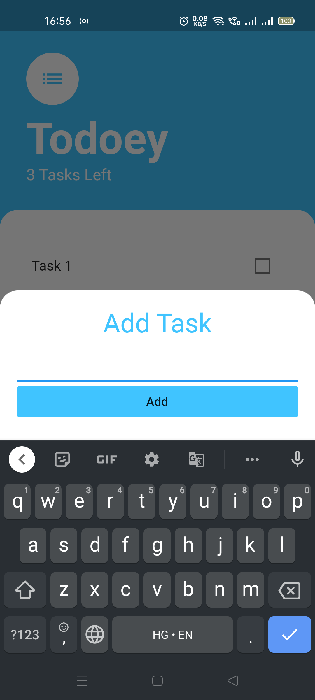
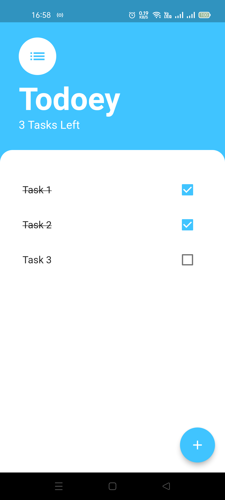
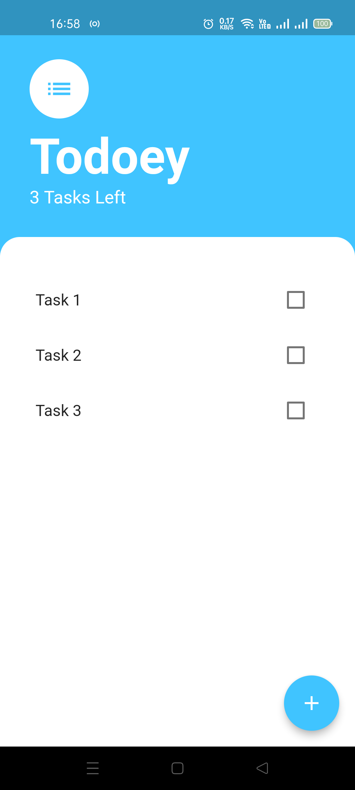

# todo_list_app

A Simple Todo List App named Todoey built with Flutter

# Screenshots from the App

## Main Screen

## Add Task Screen

## Checked and Unchecked Tasks

  
   

## State Management Concepts

- Difference between Local and Global State
- How to Implement it (check tasks list) using void callbacks
- It is performed by Lifting the StateFul Widget up the Tree 

## Provider Package

- Implements State Management easily rather than **prop drilling** like before 

## ListView Builder

- List View Builder is a constructor that builds a `List<Widget>` on Demand . It builds only the ones visible saving computation time.
